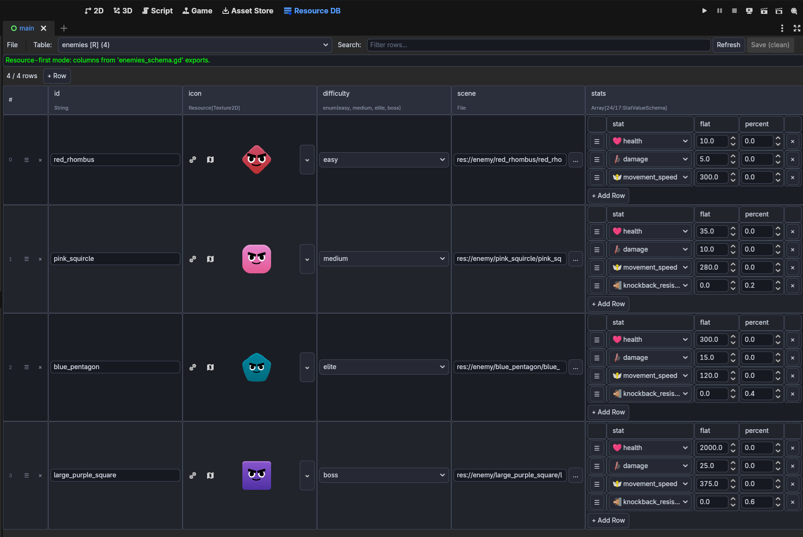
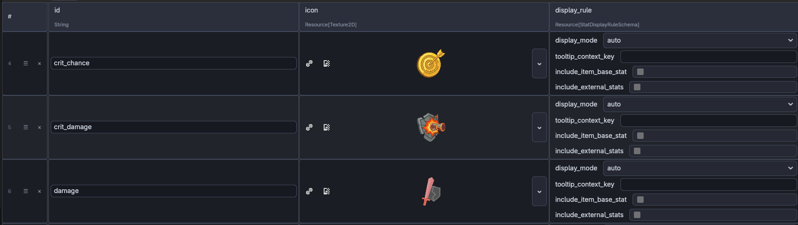
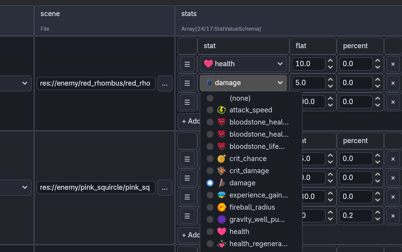
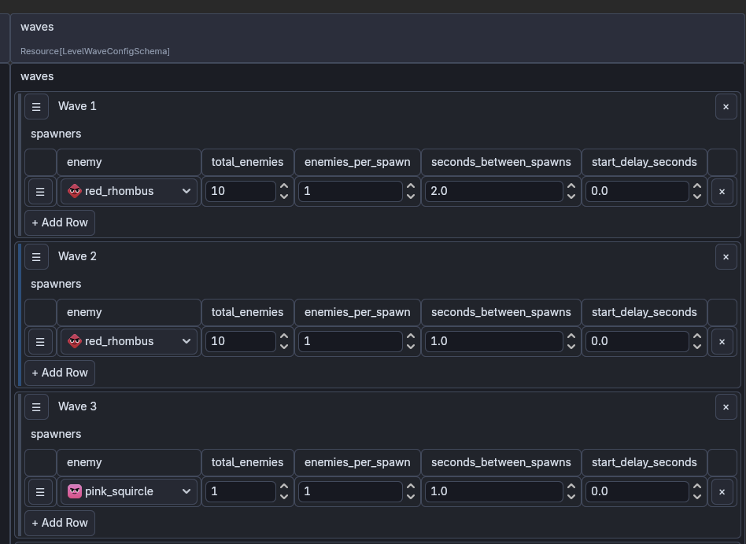

# Godot Resource Database

A Godot editor plugin that provides a spreadsheet-like database editing experience backed by Godot `Resource` files. Query, validate, and edit resource-based tables without leaving the editor.

Originally built for [Shape Survivors](https://store.steampowered.com/app/4575540/Shape_Survivors/). The screenshots below use real table configurations from the game.



## Installation

1. Copy the `addons/godot-resource-database/` folder into your project's `addons/` directory.
2. Open **Project > Project Settings > Plugins** and enable **Godot Resource Database**.
3. The **Resource DB** tab will appear in the editor.

## Core Concepts

| Concept | Resource/API | Purpose |
|---|---|---|
| Database | `GRDDatabaseAsset` | Top-level saved `Resource` containing tables |
| Table | `GRDTableAsset` | One saved table: name, ID field, schema, and rows |
| Table Schema | `GRDTableSchema` | User-authored base class for table schemas. Exported properties become columns |
| Cell Schema | `GRDCellSchema` | User-authored base class for nested editable cell resources inside a row |
| Row | `GRDRow` | Runtime/helper adapter over one Resource-backed row (not user-generated) |
| Column | `GRDColumn` | Runtime/helper column descriptor derived from `@export` property metadata (not user-generated) |

## Quickstart

## What It Looks Like

### Spreadsheet Editing



### Table References



### Complex Cell Schemas



### 1. Create the Database Asset

Create or open `res://database/database.tres` as a `GRDDatabaseAsset`. This is the root asset the editor opens and the runtime loads.

### 2. Add Tables

Add one `GRDTableAsset` for each table and set:

| Property | Description |
|---|---|
| `table_name` | Unique name for lookup, e.g. `&"items"` |
| `id_field` | Property on each row used as its ID. Defaults to `&"id"` |
| `schema` | The `GRDTableSchema` script for this table |

### 3. Define Table Schemas

Table schemas usually live under `res://database/schema/` and extend `GRDTableSchema`. Exported properties become spreadsheet columns automatically.

```gdscript
class_name ItemsSchema
extends GRDTableSchema

@export var icon: Texture2D
@export_file("*.tscn") var scene: String
@export var in_demo: bool
@export var stats: Array[StatValueSchema]
@export var upgrade_1: UpgradeSchema


func get_sticky_columns() -> PackedStringArray:
    return PackedStringArray(["id", "icon"])
```

Override `get_sticky_columns()` to pin columns to the left.

### 4. Define Nested Cells

Editable cells that need structured data extend `GRDCellSchema`. These show up as inline editable cells in the spreadsheet.

```gdscript
class_name StatValueSchema
extends GRDCellSchema

@export var stat: StatsSchema
@export var flat: float
@export var percent: float
```

### 5. Query the Database

Generate constants from the editor panel first: **More > Generate GDScript constants**. This writes a sibling script next to the database asset, named from the asset file. For `res://database/database.tres`, the generated script is `res://database/database.gd` with `class_name Database`.

Use the generated class for both constants and runtime table access:

```gdscript
var items := Database.table(Database.Items.TABLE)
var sword := items.get_row(Database.Items.Id.SWORD)
print(sword.get_value(Database.Items.NAME))
```

The generated script includes:

- one inner class per table
- `TABLE`, `ID_FIELD`, column constants, and row ID constants
- `raw`, the loaded `GRDDatabase`
- `table(name)`, a shortcut for `raw.get_table(name)`

For C# projects, also run **More > Generate C# constants**. For `res://database/database.tres`, this writes `res://database/Database.Generated.cs` beside the asset and refreshes the GDScript bridge it calls. The generated C# file contains typed `StringName` constants and a small runtime bridge that keeps dynamic GDScript calls in one place:

```csharp
using Game.Database;

var items = Database.Table(Database.Items.TABLE);
var sword = Database.Row(Database.Items.TABLE, Database.Items.Id.SWORD);
var name = sword.Call("get_string", Database.Items.NAME, "").AsString();
```

You can also load a database manually when you need a different asset at runtime:

```gdscript
var db := GRDDatabase.load_from_path("res://database/database.tres")
var table: GRDTable = db.get_table(&"items")

# Find by equality (uses lazy index).
var rows := table.where_eq("name", "Sword")
for r in rows:
    print(r.get_id(), " -> ", r.get_value("damage"))

# Fluent query builder.
var strong := table.query() \
    .where_gt("damage", 5) \
    .order_by("damage", false) \
    .limit(3) \
    .to_array()

# Predicate filter.
var expensive := table.where(func(r: GRDRow) -> bool:
    return r.get_value("damage", 0) > 100)
```

### Dotted Path Access

```gdscript
# Resolves nested Resource properties, Dictionary keys, and arrays.
var first_tag := row.get_value("tags.0", "")
var label := row.get_value("stats.label", "")
```

## Runtime Query API

### GRDDatabase

| Method | Description |
|---|---|
| `load_from_path(path, options)` | Load from a `.tres`/`.res` path |
| `load_from_asset(asset, options)` | Load from an already-loaded asset |
| `get_table(name)` | Get a table by name |
| `has_table(name)` | Check if a table exists |
| `table_names()` | All table names |
| `table_count()` | Number of tables |
| `validate()` / `get_issues()` | Validation issues from loading |

### GRDTable

| Method | Description |
|---|---|
| `all()` | All rows in insertion order |
| `get_row(id)` | Row by ID |
| `size()` | Row count |
| `where_eq(field, value)` | Equality query (indexed) |
| `find_eq(field, value)` | First match |
| `where(predicate)` | Predicate filter |
| `query()` | Fluent query builder |

### GRDQuery (fluent builder)

| Method | Description |
|---|---|
| `where_eq`, `where_ne`, `where_gt`, `where_gte`, `where_lt`, `where_lte` | Comparison filters |
| `where_in(field, array)` | Value in candidate set |
| `where_contains(field, value)` | Array membership |
| `where_any(field)` | Nested array-element query |
| `where(predicate)` | Custom predicate |
| `order_by(field, ascending)` | Sort results |
| `limit(n)`, `offset(n)` | Pagination |
| `to_array()`, `first()`, `count()`, `ids()` | Terminal operations |

### GRDRow

| Method | Description |
|---|---|
| `get_id()` | Row identifier |
| `get_value(path, default)` | Dotted path resolution |
| `has_path(path)` | Path existence check |
| `keys()` | Visible column names |
| `as_dictionary()` | All keys/values as Dictionary |
| `get_string`, `get_int`, `get_float`, `get_bool` | Typed getters |

## Editor Features

- Open/select a `GRDDatabaseAsset` by path or file dialog
- List tables with row counts and resource-first indicators
- Table schema picker for setting typed Resource scripts
- Spreadsheet-style row/column view with property-derived columns
- Inline cell editors for `String`, `StringName`, `int`, `float`, `bool`, enums, `Resource` references, `Script` references, and `Array` properties
- Visible-cell search (filters displayed rows)
- Validation panel showing errors, warnings, and info issues
- Add/remove rows (uses `create_row()` with auto-ID)
- Dirty tracking with explicit Save semantics

## Validation

`GRDDatabase.validate()` reports issues at load time:

- Duplicate/missing row IDs
- Empty/duplicate table names
- Row type mismatches (rows don't match `schema`)
- Schema does not produce a `Resource` instance
- Null rows

Issues have three severity levels: `ERROR`, `WARNING`, and `INFO`. Use `format()` or `str(issue)` for human-readable output.
